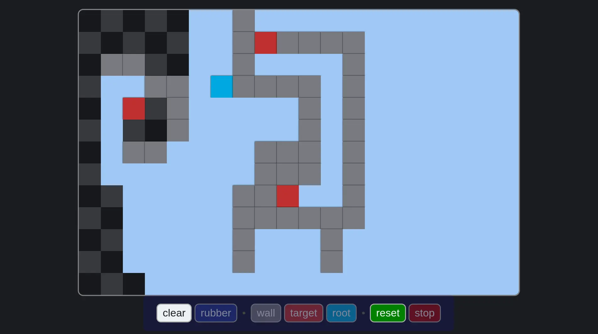

# Draw Algos
Draw on a grid and let algos run.  
Play with it at: https://github.com/AlessandroTambellini/draw-algos  
Instead, to run it locally, open `index.html` in a browser.

## TODO
Some additional feature/functionality you may add:
- Some default maze:
    A side panel with some default pattern/maze to choose from.
- New algos:
    Inside the code, there is the template on how to add new algos.
