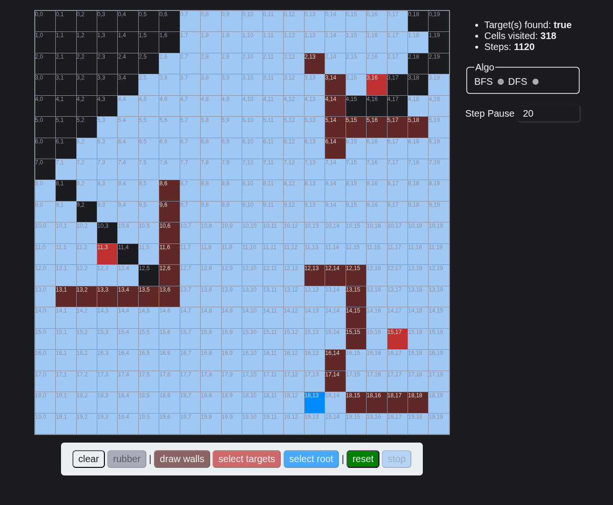

# Draw Algos
Draw on a grid and let algorithms run.

## TODO
Some additional feature/functionality you may add:
- Some default maze:
    A side panel with some default pattern/maze to choose from.
- New algos:
    I left the skeleton on how to add a new algo in the code.
