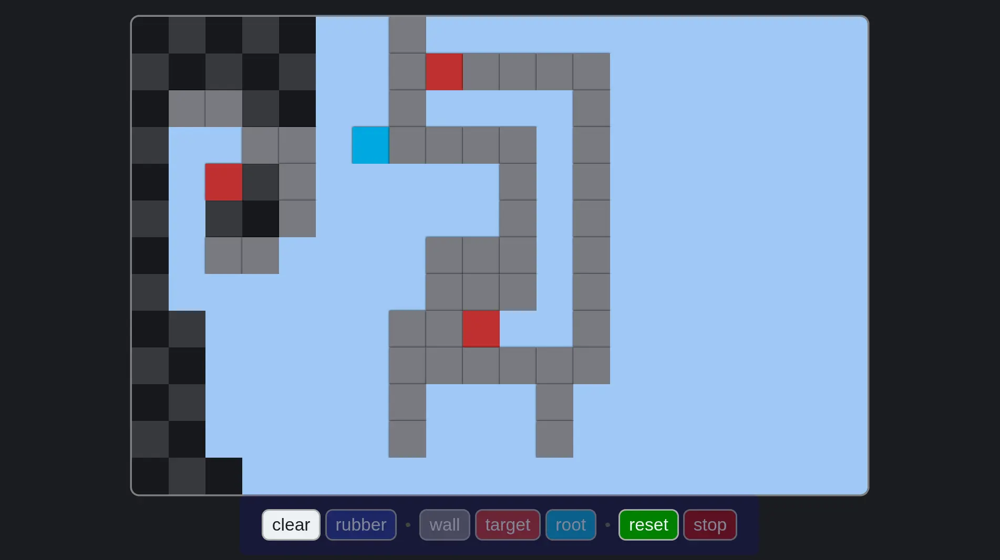

# Draw Algos
Draw on a grid and let algos run.  
Play with it at: https://github.com/AlessandroTambellini/draw-algos  
Instead, to run it locally, open `index.html` in a browser.

## Homework
A side panel with some default pattern/maze to choose from may be added
